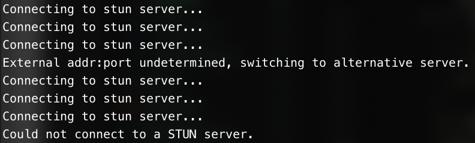
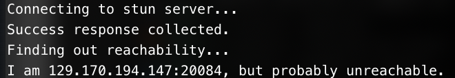
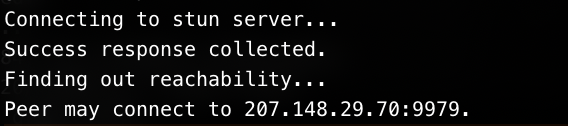

# STUN client: a NAT detector

## Description
The client is a STUN NAT-detector - it reports your external addr:port information when your device is behind a NAT.

## Possible outcome

### Failed connection 

The message returned in this scenario will be "Could not connect to a STUN server". The client query the stun server for a response first, when it fails, either the server returns an error response or the server could not be reached after the timeout, it would attempt to query the alternative server. If still to no avail, the failed connection message will be returned.

### Unreachable

When the client succeeds in getting the external addr:port info, it would query the STUN server again, with a change-request. When the server responds with a different combination of addr:port, if the client can no longer receive the packet, this suggests the router/NAT gateway is only allowing traffic between internal hosts and those they had previously sent packets to.

This suggests the client is behind a NAT that restricts direct traffic from the outside.

### Possible outcome: reachable

The "Peer may connect to addr:port." message is only shown when the client can get success response from both a simple request and a change-request. In this case we can expect the device to be reachable from the outside of NAT.

## Running the client
To run this client:
- Run `make client` in the project root directory to compile the NAT-detector.
- Run `./client` to start the client.
- Run `make clean` to cleanup the object files and executables.
- Run `make kill` to terminate the running client.

## Middleman
To send messages across the NAT gateway, a server with a globaly reachable ip can be used to forward all the incoming messages to the user behind NAT. `middleman` is made for this purpose.

To test this program:
- run `make middleman; ./middleman` on a machine that is not behind an NAT.
- From the device behind a NAT, send a udp packet to the port the machine is listening (by default 81)
- Once the middleman indicates that the packet is received, send any udp packet to the same port
- The device should receive the relayed packet from the same port

## Mailman
Send udp packets with arbitrary addresses and ports from terminal.

To test this program:
- run `make mailman`
- run `./mailman src_addr src_port dst_addr dst_port str`, with arguments filled in accordingly. `str` is the data of the udp packet.

